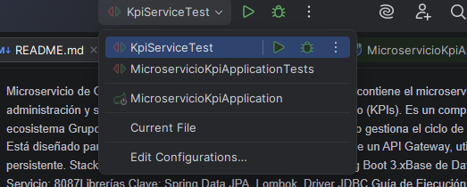
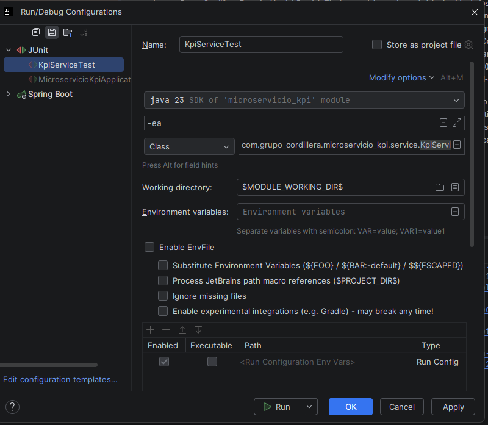
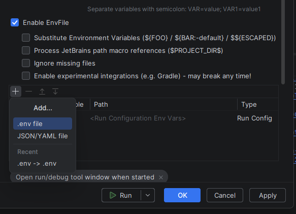
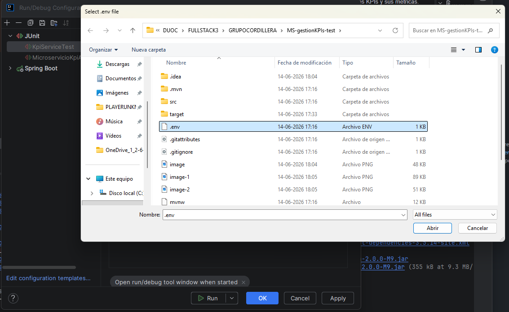

Microservicio de Gestión de KPIs - Grupo CordilleraEste repositorio contiene el microservicio encargado de la administración y seguimiento de los indicadores clave de desempeño (KPIs). Define Metricas las cuales se llenan de infromación sobre las ventas y productos vendidos. El microservicio esta diseñado para integrarse y ser expuesto a tráves de un Backend for Frontend, utilizando una base de datos persistentes. 
Stack Técnologico Java 17 o superior
Framework: SpringBoot 3.x
Base de Datos: PostgreSQL
Puerto: 8087
Librerias clave: Spring Data JPA (persistencia de datos)
                Driver JDBC.
Guía para ejecución, abrir PGAdmin 4 o visualizador (navicat), crear base de datos con nombre 'kpi', configurar usuario y contraseña en .ENV. Una vez realizado esto se debe añadir el env a la configuracion run/debug, para que de esta forma el proyecto pueda leer el .env. Para esto tendremos que descargar el plugin llamado ENVFILE, se instala y luego lo configuramos en , seleccionamos edit config 
 marcamos enable envfile, para luego agregar el .env
, seleccionamos el .env al que hara referencia , luego aplly y OK. Con esto pasamos al siguiente paso que sera cambiar las variables en el -env, donde iria su usuario de postgreSQL y su contraseña local. Con esto se puede correr el proyecto.
Para hacer las pruebas en swagger se debe acceder a la siguiente ruta http://localhost:8087/swagger-ui.html